# Visual Java — Design Notes

How the plugin is put together, the data flow under each user gesture, and
where to look (or hook) when you want to extend it.

- [Architecture at a glance](#architecture-at-a-glance)
- [Repo layout](#repo-layout)
- [The sidecar JavaFX renderer](#the-sidecar-javafx-renderer)
- [FXML PSI as the source of truth](#fxml-psi-as-the-source-of-truth)
- [Threading model](#threading-model)
- [Key extension points](#key-extension-points-pluginxml)
- [Tour of the major packages](#tour-of-the-major-packages)
- [Persistence formats](#persistence-formats)
- [Container drop policy](#container-drop-policy)
- [Component docs catalog](#component-docs-catalog)
- [Web export pipeline (v2 scaffold)](#web-export-pipeline-v2-scaffold)
- [Data flow under each gesture](#data-flow-under-each-gesture)
- [How to add a widget](#how-to-add-a-widget)
- [How to add a recipe](#how-to-add-a-recipe)
- [Decisions we deliberately made](#decisions-we-deliberately-made)
- [Non-goals for v1](#non-goals-for-v1)

---

## Architecture at a glance

Two JVMs cooperate: the IDE's own JVM (where the plugin runs) and a sidecar
JavaFX renderer the plugin launches on demand. They talk over a localhost
TCP socket using newline-delimited JSON.

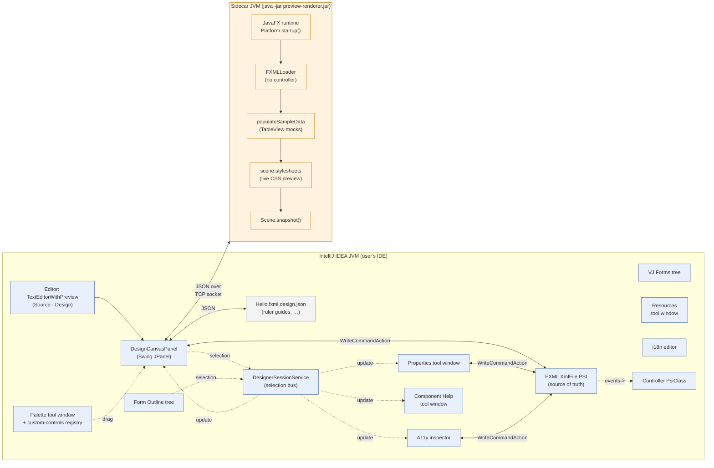

**Why two JVMs?** JetBrains removed `JFXPanel` (Swing-embedded JavaFX) in
IntelliJ 2025.1, so we can't host JavaFX inside the IDE UI. The sidecar
approach also keeps JavaFX out of the IDE classpath entirely — no version
conflicts with the platform, no class-loader gymnastics.

---

## Repo layout

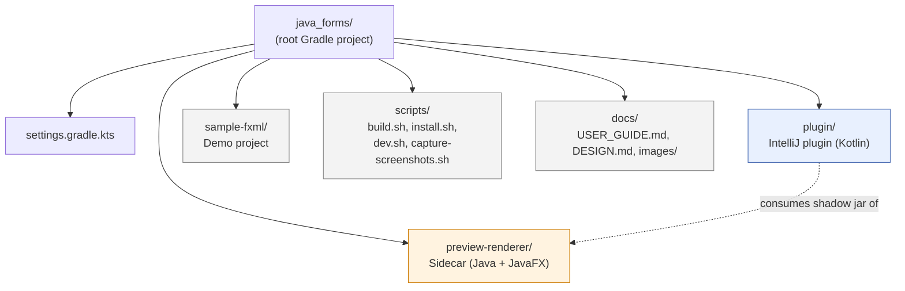

Inside the plugin module, the Kotlin sources are organised by feature:

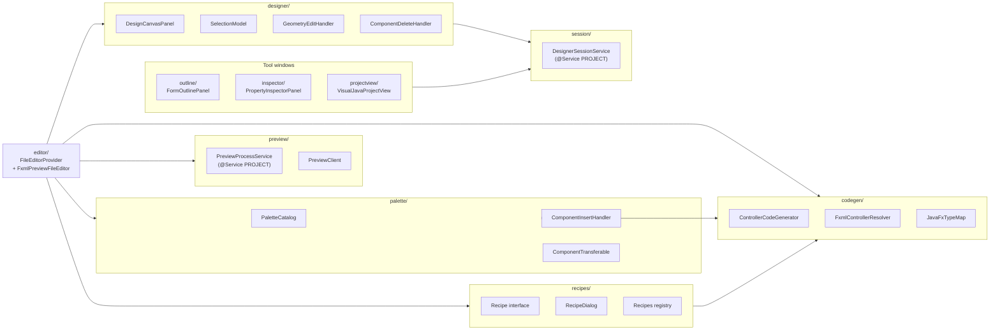

Plus smaller packages for cross-cutting features:
- `alignment/` — settings + designer toolbar + AlignActions; now includes `highlightFocusable` toggle that drives the on-canvas focus badges
- `events/` — EventCatalog, EventWiringHandler, EventHandlerExamples
- `pojo/` — PojoIntrospector, PojoBinder, PojoBindingDialog, FormFromPojoAction
- `menueditor/` — MenuEditorDialog (with `loadExistingMenuBar()` round-trip)
- `taborder/` — TabOrderDialog (with drag-drop reorder + cross-parent reparenting)
- `tableeditor/` — TableViewColumnEditorDialog
- `refactor/` — FxIdRenamer
- `run/` — RunCurrentFormAction
- `wizard/` — NewFxmlFileAction + FormTemplates
- `help/` — ComponentDoc + ComponentDocsCatalog + ComponentHelpPanel + SampleCodeInserter
- `resources/` — ResourceManagerPanel (browse + import project assets)
- `i18n/` — I18nManagerPanel (`.properties` bundle grid editor)
- `a11y/` — AccessibilityPanel (focusable widgets + accessibleText/Role/Help + lint)
- `jpackage/` — JPackageDialog + JPackageAction
- `web/` — FxmlToHtmlTranslator + ExportToWebAction (v2 scaffold)
- `palette/` adds `ContainerDropInfo`/`ContainerDropPolicy` + `CustomControlsRegistry` + `RegisterCustomControlDialog`

---

## The sidecar JavaFX renderer

`preview-renderer/.../PreviewRenderer.java` is a self-contained main:

1. Boots the JavaFX runtime via `Platform.startup()`.
2. Binds a localhost-only TCP socket on an ephemeral port.
3. Writes `PORT=<n>\n` to stdout, so the parent plugin can discover it.
4. Reads newline-delimited JSON commands and replies in kind.

### Wire protocol

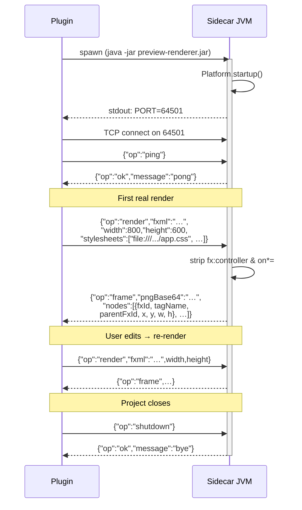

Each rendered node carries:

| Field | Meaning |
|---|---|
| `fxId` | Required — we only emit nodes with `fx:id` |
| `tagName` | JavaFX class's `getSimpleName()` — drives container hit-tests and per-widget cheat-sheets |
| `parentFxId` | Nearest ancestor with an fx:id, or empty if "at root" — drives Alt-click → parent |
| `x, y, w, h` | Scene-coordinate bounds in pixels |

The renderer **strips** any `fx:controller="…"` and any `on*="#…"` attribute
before handing the FXML to `FXMLLoader`. Without that, FXMLLoader insists on
resolving the controller class, which doesn't exist on the renderer's
classpath.

**Sample data for TableView.** After `FXMLLoader.load()` returns, the
renderer walks the scene graph for `TableView` instances and installs 5
mock rows + per-column `cellFactory` that renders `"<column-text> <row>"`.
The user's real `PropertyValueFactory` bindings don't run here (no user
beans available), so this gives the canvas a populated table without
requiring controller code.

**Live CSS preview.** Each render the plugin discovers every `.css` under
the project's resource roots (via `ProjectStylesheets.discover()`) and
sends the URLs in the `stylesheets` array. The renderer applies them to
the Scene via `getStylesheets().addAll(...)` before `snapshot()`. Edits
to project CSS files reflect in the next render.

**JavaFX modules bundled into the renderer.** `preview-renderer/build.gradle.kts`
declares `javafx.controls`, `javafx.fxml`, `javafx.graphics`, `javafx.swing`,
`javafx.web`, `javafx.media`. So WebView/HTMLEditor/MediaView/Charts all
render in the designer regardless of what the user's project lists.

### Process lifecycle (plugin side)

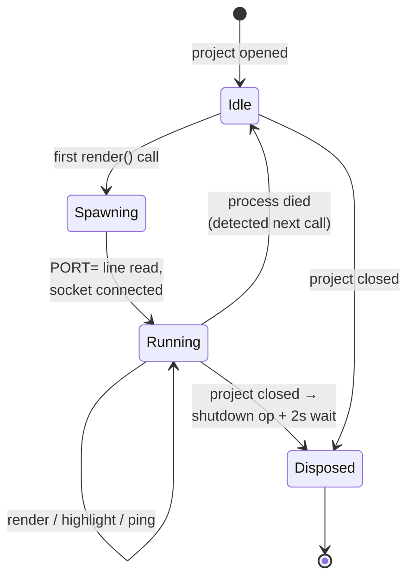

The class is `PreviewProcessService`, a `@Service(Service.Level.PROJECT)`.
On first `client()` call:

1. Copies the bundled `/preview-renderer/preview-renderer.jar` (packed
   inside the plugin jar at build time) into
   `PathManager.getSystemPath()/visual-java/`.
2. Launches it with `System.getProperty("java.home")/bin/java` — same JBR
   the IDE runs on, so JavaFX modules are available.
3. Reads stdout until it sees `PORT=`, parses the port number.
4. Spawns daemon threads to drain stdout/stderr to the IDE log.
5. Hands out a `PreviewClient` (a single TCP socket, one request at a time).

---

## FXML PSI as the source of truth

We keep no in-memory model of the form. **The FXML `XmlFile` PSI is canonical.**

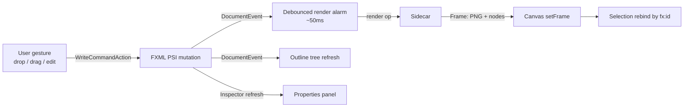

Consequences:

- Every designer mutation goes through `WriteCommandAction.runWriteCommandAction`
  so it lands in one undo step and IntelliJ's PSI/Document/VFS layers stay
  in sync.
- The Source tab is just the standard IntelliJ XML editor with the same
  `Document`. Hand-edits round-trip back to the canvas via a
  `DocumentListener`.
- The Form Outline tree subscribes to document changes and rebuilds from
  PSI on a 200ms alarm.
- Render requests serialise `document.text` and send it over the socket.
  The renderer parses it fresh every time.

The plugin **never** holds onto a `NodeBounds` or controller `PsiClass`
across a write — it re-fetches from PSI on each use.

### Generated code is also user code

`ControllerCodeGenerator` emits `@FXML` fields, event handlers,
`initialize()`, and plain support methods (`handleSubmit`, `colorToHex`, …)
directly into the user's controller via PSI manipulation.

The **iron rule**: we *only add*. We never overwrite an existing field,
method, or body. Recipes that append to `initialize()` use idempotency
checks — running a recipe twice with the same roles does nothing the second
time.

---

## Threading model

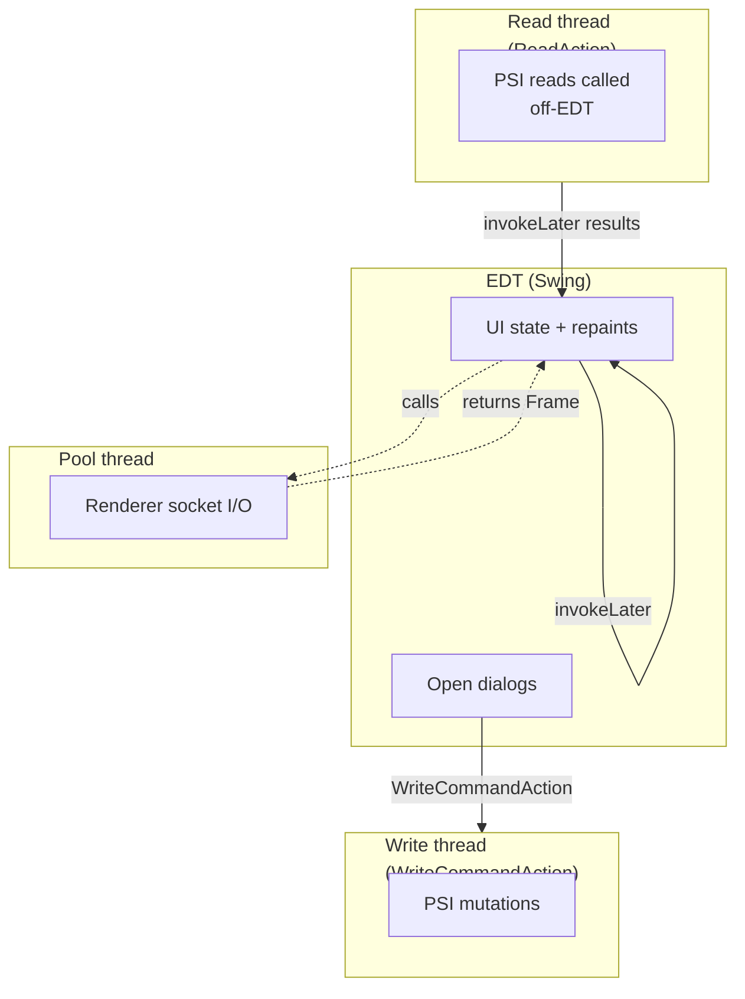

| Thread | What's allowed |
|---|---|
| EDT (Swing) | UI state, repaints, opening dialogs. **No** PSI reads/writes that could block. |
| IntelliJ pooled (`ApplicationManager.executeOnPooledThread`) | Renderer socket I/O. |
| Write thread (via `WriteCommandAction`) | All PSI mutations. |
| Read thread (via `ReadAction`) | PSI reads when called from off-EDT contexts. |

The sidecar process itself is single-threaded on the JavaFX Application
Thread — each `render` op runs `Platform.runLater` and waits on a
`CountDownLatch`.

Document changes trigger re-render via a 50ms `Alarm.SWING_THREAD`
debounce. Designer-driven writes additionally call `renderNow()` which
cancels the alarm and triggers immediately, so the next gesture sees fresh
node bounds.

---

## Key extension points (plugin.xml)

| Extension | Class | Purpose |
|---|---|---|
| `com.intellij.fileType` | (extends platform XML) | Registers `.fxml` as XML so we work even when the bundled JavaFX plugin is disabled |
| `com.intellij.fileEditorProvider` | `FxmlDesignerEditorProvider` | Dual-tab editor for `.fxml`. `getPolicy() = HIDE_OTHER_EDITORS` suppresses competing tabs |
| `com.intellij.notificationGroup` | id `"Visual Java"` | Balloon notifications for codegen failures |
| `com.intellij.toolWindow` (7) | Palette, Properties, VJ Forms, Resources, i18n, A11y, Component Help | Two left (Palette stack + VJ Forms) + five right |
| `com.intellij.action` (10) | NewFxmlForm, FormFromPojo, WireUp, BindPojo, MenuEditor, TabOrder, RunForm, WireAll, JPackage, ExportToWeb | All findable via `Cmd+Shift+A` so the cliclick capture scripts can drive them |
| `<depends>` | `com.intellij.java`, `com.intellij.modules.xml`, `com.intellij.gradle` | Hard dependencies on Java PSI, XML support, and Gradle integration |

Project services (auto-registered via `@Service(Service.Level.PROJECT)`):

- `PreviewProcessService` — sidecar renderer lifecycle
- `DesignerSessionService` — selection bus
- `AlignmentSettings` — persistent toggle state via `PropertiesComponent`
- `CustomControlsRegistry` — per-project palette extensions stored at `.idea/visualjava-custom-controls.json`

The bundled JavaFX plugin (`org.jetbrains.plugins.javaFX`) is disabled in
the sandbox via writing `disabled_plugins.txt` to the sandbox config dir.
Real installs require users to disable it manually — there's no
programmatic way for one plugin to disable another at runtime.

---

## Tour of the major packages

### Editor (`editor/`)

`FxmlDesignerEditorProvider` (DumbAware, FileEditorProvider) creates a
`TextEditorWithPreview` that pairs the platform's XML text editor with
`FxmlPreviewFileEditor`. The latter owns the canvas + toolbar, wires every
callback (drop / delete / geometry-commit / alignment / wire-up / run / tab
order / menu editor / POJO binding), and manages the debounced re-render
`Alarm`.

### Designer canvas (`designer/`)

`DesignCanvasPanel` blits the renderer's PNG and overlays all chrome:
selection rectangles + handles, smart-guide lines, ruler-drag preview,
user-placed ruler guides, rulers, grid, ghost outline during drag. Owns the
gesture state machine:

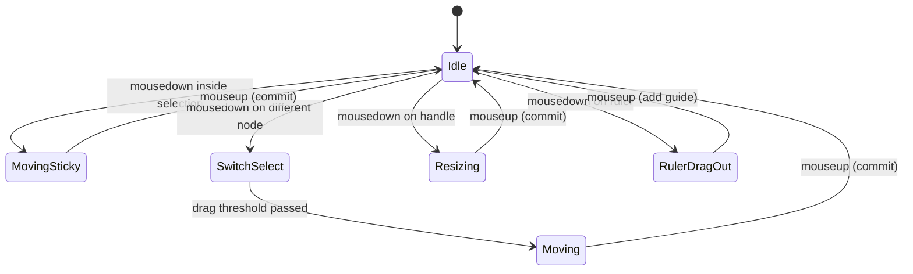

`SelectionModel` holds a primary + N additional selections with listeners.
`rebind(nodesByFxId)` refreshes bounds from each new frame without
switching identities.

### PSI write handlers

| Class | Responsibility |
|---|---|
| `palette.ComponentInsertHandler` | Adds a widget to FXML (auto `<?import?>`, fx:id generation, optional parent nesting) |
| `designer.GeometryEditHandler` | Batch writes layoutX/Y, prefWidth/Height |
| `designer.ComponentDeleteHandler` | Removes a list of fx:ids |
| `codegen.ControllerCodeGenerator` | `ensureField`, `ensureHandler`, `ensureHandlerWithBody`, `ensureInitialize`, `appendStatement` (idempotent), `ensurePlainMethod`, `wireFxmlEvent` |
| `codegen.FxmlControllerResolver` | Finds or creates the controller class; never falls back to writing a `.java` into resources/ |
| `refactor.FxIdRenamer` | Renames fx:id + field + matching methods + #refs in one undo step |

### Catalogs (the registries you'll edit to add widgets)

| Class | What it knows |
|---|---|
| `palette.PaletteCatalog` | Every palette entry (tag, display, FQN, category, default attrs) |
| `codegen.JavaFxTypeMap` | Tag → FQN for controller `@FXML` field types |
| `inspector.PropertyCatalog` | Per-tag list of editable properties for the inspector |
| `events.EventCatalog` | Per-tag default event + full event list |
| `events.EventHandlerExamples` | Per-(tag, event) commented cheat-sheet injected into freshly-generated handlers |

### Recipes (`recipes/`)

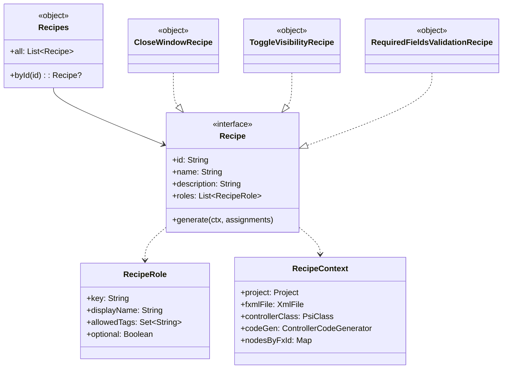

### POJO binding (`pojo/`)

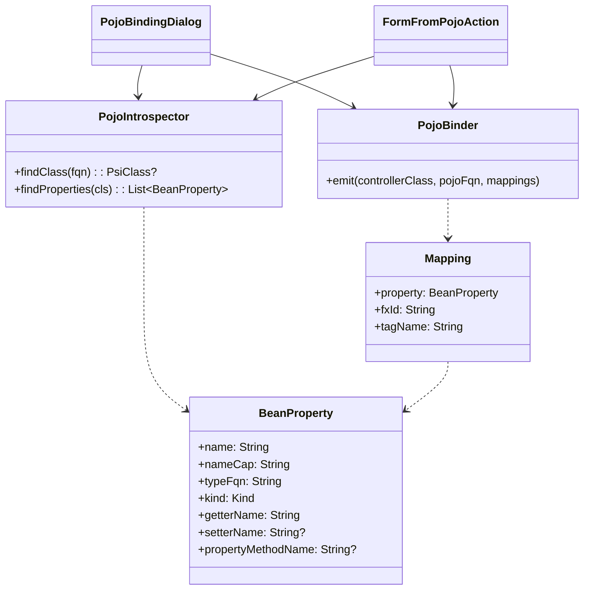

---

## Persistence formats

The plugin writes a small number of files outside the FXML itself. None of
them are required for the form to compile or run — they all hold
designer-only state.

| File | Owner | Contents |
|---|---|---|
| `<Form>.fxml.design.json` | `designer.DesignSidecar` | Per-form designer state. Currently holds `verticalGuides` and `horizontalGuides`; reserved for `pendingEventBindings`, `v2Hints`. Co-located with the FXML so it follows it through VCS / renames. |
| `.idea/visualjava-custom-controls.json` | `palette.CustomControlsRegistry` | Per-project list of user-registered palette entries. Shareable via VCS so a team palette is consistent. |
| `<Form>.properties` / `<Form>_xx.properties` | i18n editor | Standard `java.util.ResourceBundle` format. Saved verbatim with `\n` escape only. |

Schema evolution: unknown fields are tolerated on read (Jackson `FAIL_ON_UNKNOWN_PROPERTIES = false`),
preserved on write. Adding a new field to either JSON file doesn't break
older plugin versions.

---

## Container drop policy

Pane-style containers (Pane, AnchorPane, GridPane, StackPane, HBox, VBox,
FlowPane, TilePane) accept children directly under `<children>` with
`layoutX`/`layoutY`. Everything else needs a different slot, and some
require the dropped node to be wrapped in another element first.

`palette.ContainerDropPolicy.decide(tagName, dropFrac)` returns a
`ContainerDropInfo` per container:

| Container | Slot | Collection? | Wrap |
|---|---|---|---|
| `Pane`, `AnchorPane`, `HBox`, `VBox`, `GridPane`, `StackPane`, `FlowPane`, `TilePane` | `children` | yes | — |
| `TabPane` | `tabs` | yes | wrap in `<Tab text="Tab"><content>…</content></Tab>` |
| `Accordion` | `panes` | yes | wrap in `<TitledPane text="Section"><content>…</content></TitledPane>` |
| `SplitPane`, `ToolBar` | `items` | yes | — |
| `ScrollPane`, `TitledPane` | `content` | no (singleton — replaces existing) | — |
| `BorderPane` | `top`/`bottom`/`left`/`right`/`center` | no | — (slot picked by which third of the pane the drop landed in) |

`ComponentInsertHandler` honours this — it suppresses `layoutX`/`layoutY`
for any slot other than `children` (they'd be meaningless inside a
BorderPane.center, a TabPane.tabs/Tab/content, etc.), creates the slot tag
if absent, and inserts the wrapper if `wrapTagName` is set.

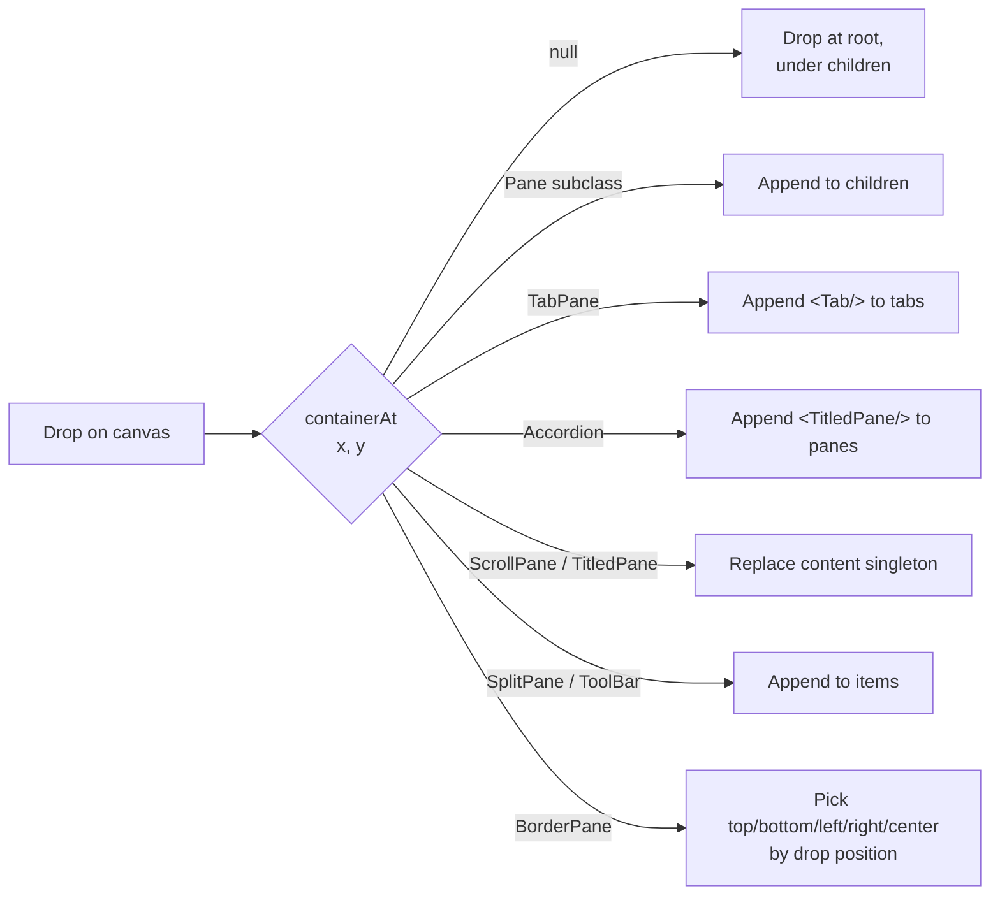

---

## Component docs catalog

`help.ComponentDocsCatalog` hand-curates ~30 widgets with `ComponentDoc`
entries containing:

- one-line `summary`,
- copy-pastable `fxmlExample`,
- typical `controllerExample` (Java `@FXML` field + usage idiom),
- `commonProperties` and `commonEvents` lists for property/event tables,
- `javadocUrl` pointing at the Oracle JavaFX 21 Javadoc.

For widgets without an entry, `ComponentDocsCatalog.get(...)` synthesises a
stub from the palette descriptor's FQN (e.g.
`javafx.scene.control.MenuButton` →
`https://openjfx.io/javadoc/21/javafx.controls/javafx/scene/control/MenuButton.html`)
so the Help window is never empty.

Three surfaces consume the catalog:

| Surface | Renders |
|---|---|
| `palette.PalettePanel` hover tooltip | Summary + FXML + controller snippets in an HTML tooltip |
| `help.ComponentHelpPanel` (Component Help tool window) | Full HTML doc with Copy/Insert links + Oracle Javadoc link |
| Canvas right-click menu | "Copy FXML sample", "Copy controller sample", "Paste sample into controller (/* */)" — all back-ended by `help.SampleCodeInserter` |

`SampleCodeInserter.insertSampleIntoController(...)` finds (or creates)
the FXML's controller via `FxmlControllerResolver.findOrCreateController()`,
wraps the controller-code sample in a `/* … */` block with a header
(`/* --- Sample code: Button --- ...*/`), and inserts it at the top of the
class body via PSI Document mutation inside a `WriteCommandAction`. After
insertion the controller file opens in the editor at the inserted offset
so the user can immediately review and uncomment.

---

## Web export pipeline (v2 scaffold)

`web.FxmlToHtmlTranslator` walks the FXML PSI tree and emits Thymeleaf-
flavoured HTML. About 12 widget types are translated explicitly:

| FXML | HTML |
|---|---|
| Pane / VBox / HBox / AnchorPane / BorderPane / etc. | `<div data-fx="X">` |
| TabPane | `<div data-fx="TabPane" role="tablist">` |
| Label | `<span>` |
| Button | `<button type="button" th:onclick="...">` (placeholder) |
| TextField / PasswordField | `<input type="text|password" name="fxId" th:value="${fxId}">` |
| TextArea | `<textarea name="fxId" th:text="${fxId}">` |
| CheckBox / RadioButton | `<label><input type="checkbox|radio" name="fxId">…</label>` |
| Hyperlink | `<a href="#">` |
| ImageView | `` |
| TableView | `<table>` with `<thead>`/`<tbody th:each="row : ${fxId}">` |
| MenuBar | `<nav data-fx="MenuBar">` |

Unknown tags emit a `<!-- TODO: translate <X> to HTML -->` comment so the
gap is visible to the user.

`web.ExportToWebAction` invokes the translator and writes:

- `web/<FormName>.html` — the Thymeleaf template
- `web/<FormName>Controller.java` — a heavily-commented Spring `@Controller`
  stub with `@GetMapping`/`@PostMapping` skeletons

Both files are placed next to the FXML so they're easy to find. The action
explicitly tells the user it's a *v2 preview* — what's missing is the
embedded browser-pane live preview, Spring model-binding generation, and
FXML ⇄ HTML round-trip. The scaffold gets the foundation in place.

---

## Data flow under each gesture

### Drag from palette → drop on canvas

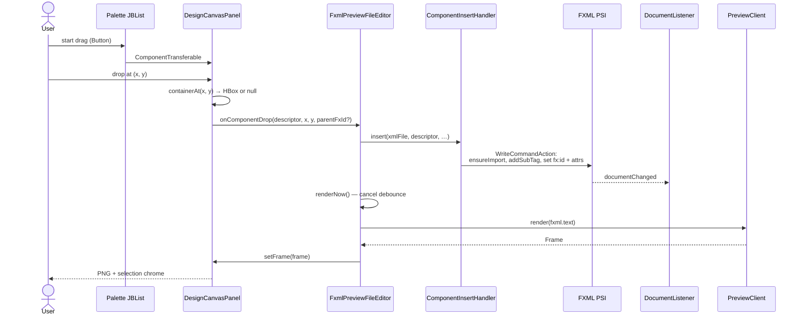

### Double-click → wire default event

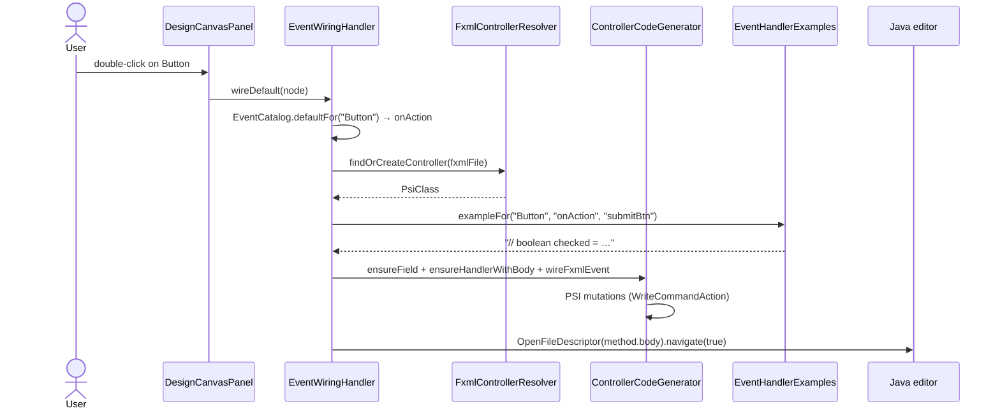

### Wire-Up recipe

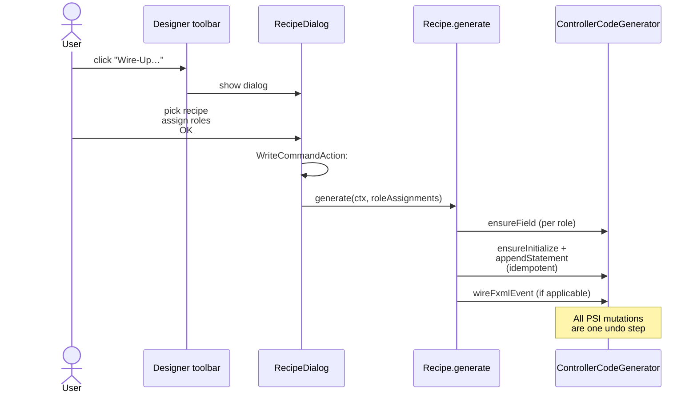

### Properties cell edit

```mermaid
sequenceDiagram
    actor U as User
    participant T as JBTable (Properties)
    participant PI as PropertyInspectorPanel
    participant XF as FXML PSI
    participant DL as DocumentListener
    participant CV as Canvas
    participant Bus as DesignerSessionService

    U->>T: type into value cell, Enter
    T->>PI: setValueAt → fireTableCellUpdated
    PI->>XF: WriteCommandAction:<br/>tag.setAttribute(name, newValue)
    XF-->>DL: documentChanged
    DL->>CV: renderNow() — debounce 50ms
    CV->>CV: setFrame → selectionModel.rebind
    PI<<--Bus: re-read current values<br/>(replaceRows)
```

---

## How to add a widget

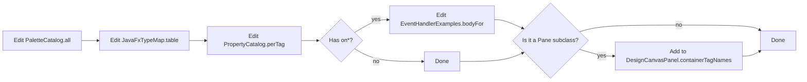

Concretely:

1. **`palette.PaletteCatalog.all`** — add a `ComponentDescriptor` with tag,
   display name, FQN, category, and default attributes. If the widget
   needs nested children to render (e.g. charts need axes), set `bodyXml`
   and `extraImports`:
   ```kotlin
   ComponentDescriptor("LineChart", "LineChart", "javafx.scene.chart.LineChart",
       DISPLAY, mapOf("prefWidth" to "400", "prefHeight" to "240"),
       bodyXml = "<xAxis><NumberAxis/></xAxis><yAxis><NumberAxis/></yAxis>",
       extraImports = listOf("javafx.scene.chart.NumberAxis")),
   ```
2. **`codegen.JavaFxTypeMap.table`** — add the FQN so `ensureField` writes
   the correct type when an event is wired.
3. **`inspector.PropertyCatalog.perTag`** — add a list of editable
   properties for the Properties panel. Use `STYLE_CLASS` kind for
   chip-style editing, `IMAGE` for a Browse-button picker.
4. (Optional) **`events.EventHandlerExamples.bodyFor`** — add a per-event
   cheat-sheet for the new widget.
5. (Optional) **`events.EventCatalog.ACTION_TAGS`** — if it's a control
   whose canonical event is `onAction`.
6. (Optional) **`DesignCanvasPanel.containerTagNames`** + a case in
   **`palette.ContainerDropPolicy.decide`** — if the widget should accept
   drops. Decide whether it uses `children`, an alternate collection
   (`items`, `tabs`, `panes`), or a singleton slot (`content`,
   `top`/`bottom`/`...`), and whether dropped nodes need to be wrapped in
   another tag.
7. (Optional) **`help.ComponentDocsCatalog.entries`** — add a
   `ComponentDoc` so the hover tooltip and Help tool window have curated
   content. Skip and you get a stub linking to Oracle Javadoc.
8. (Optional) **`web.FxmlToHtmlTranslator.emit`** — add a `when` arm if
   you want the widget to translate to something more specific than the
   generic `<!-- TODO -->` comment in the v2 web export.

No other code changes needed — the renderer discovers the tag via
`n.getClass().getSimpleName()`.

---

## How to add a recipe

1. Drop a new `object MyRecipe : Recipe` into **`recipes/Recipes.kt`**.
   Define `roles` and `generate`:
   ```kotlin
   object MyRecipe : Recipe {
       override val id = "my-recipe"
       override val name = "My Recipe"
       override val description = "What it does, one sentence."
       override val roles = listOf(
           RecipeRole("trigger", "Trigger", "Description.",
                      allowedTags = setOf("CheckBox")),
       )

       override fun generate(ctx: RecipeContext, roleAssignments: Map<String, String>) {
           val trigger = roleAssignments["trigger"] ?: return
           ctx.codeGen.ensureField(ctx.controllerClass, trigger, "CheckBox")
           val init = ctx.codeGen.ensureInitialize(ctx.controllerClass)
           ctx.codeGen.appendStatement(init, "// $trigger custom setup")
       }
   }
   ```
2. Add it to **`Recipes.all`**.
3. Done. The dialog discovers it automatically and builds role-assignment
   dropdowns from `roles`.

`appendStatement` is idempotent — re-running the recipe with the same
components is a no-op. Use `ensurePlainMethod` for helper methods (no
`@FXML`). Use `ensureHandlerWithBody` for `@FXML` event handlers with a
seed body.

---

## Decisions we deliberately made

- **Kotlin for the plugin, Java for everything we generate or sidecar.** The
  IntelliJ Platform is overwhelmingly Kotlin-first in 2025+; user code stays
  Java because that's what they signed up for.
- **The renderer is a separate JVM.** Avoids JavaFX-in-IntelliJ (removed in
  2025.1), keeps version conflicts impossible, gives us pixel-accurate
  preview at the cost of ~200ms IPC per render.
- **PSI is the source of truth.** Every write goes through PSI inside a
  `WriteCommandAction`. Undo, hand-edits, and Source-tab round-trip all
  come for free.
- **We never overwrite user code.** ensure-not-replace. Cheat-sheets only
  land in freshly-generated method bodies.
- **No silent failures.** If something we'd write would go in a wrong place
  (a `.java` into a resources directory, for example), we throw and surface
  a balloon notification instead.
- **The sandbox disables the bundled JavaFX plugin.** Its Scene Builder
  editor's EDT-blocking listeners freeze the IDE on Undo. Real installs
  need the user to do this manually — we tell them in the install script.

---

## Non-goals for v1

- **Embedding Scene Builder Kit.** Its public API isn't stable enough.
- **Multi-form refactor support beyond rename-within-form** — single-form
  refactoring only for v1.
- **ListView/TreeView sample data preview** — only TableView gets mocked
  rows. The others render empty (the data shape isn't constrained by FXML
  so we can't usefully fake it).
- **Web export beyond the v1 scaffold.** The translator + Spring controller
  stub are in place, but live browser-preview, automatic Spring
  model-binding generation, and FXML ⇄ HTML round-trip remain v2 work.
- **Custom-control class loading in the sidecar.** Drops register the
  custom tag in FXML correctly, but the renderer's classpath doesn't
  include user-compiled classes — the canvas falls back to "Render failed"
  for the custom widget. Adding user classes to the renderer classpath is a
  follow-up.
- **Wholesale FXML refactors driven from Tab Order.** Drag-drop reorder +
  cross-parent reparenting work for individual focusable widgets; moving a
  container subtree across parents needs a hand-edit.
