# Visual Java — User Guide

A complete tour of the plugin. Read it straight through or jump to a section.

> Screenshots in this guide are populated by `scripts/capture-screenshots.sh`
> — it walks you through capturing each one. If the images don't display
> below, they haven't been captured yet; the captions describe what each
> shows.

## Contents

- [The IDE layout at a glance](#the-ide-layout-at-a-glance)
- [Installation](#installation)
- [Creating a form](#creating-a-form)
- [The Designer chrome](#the-designer-chrome)
  - [Palette tool window](#palette-tool-window)
  - [Form Outline tree](#form-outline-tree)
  - [Properties tool window](#properties-tool-window)
  - [VJ Forms tool window](#vj-forms-tool-window)
  - [Designer toolbar](#designer-toolbar)
- [Selection & manipulation](#selection--manipulation)
- [Alignment helpers](#alignment-helpers)
- [Wiring events](#wiring-events)
- [Wire-Up recipes](#wire-up-recipes)
- [Visual editors](#visual-editors)
  - [Menu Editor](#menu-editor)
  - [Tab Order](#tab-order)
  - [TableView Column Editor](#tableview-column-editor)
  - [POJO Binding Wizard](#pojo-binding-wizard)
- [Component Help & sample code](#component-help--sample-code)
- [Resources tool window](#resources-tool-window)
- [i18n editor](#i18n-editor)
- [Accessibility inspector](#accessibility-inspector)
- [Custom controls](#custom-controls)
- [Packaging (jpackage)](#packaging-jpackage)
- [Export to web (v2 preview)](#export-to-web-v2-preview)
- [Power-user features](#power-user-features)
- [Running the app](#running-the-app)
- [Source-tab round-trip](#source-tab-round-trip)
- [Known limitations](#known-limitations)
- [Troubleshooting](#troubleshooting)

---

## The IDE layout at a glance

When an FXML file is open, the IDE looks like this:

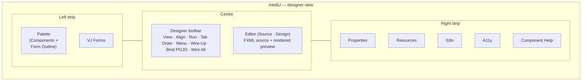
```mermaid
flowchart LR
    subgraph IDE["IntelliJ — designer view"]
        direction LR
        subgraph L["Left strip"]
            P["Palette<br/>(Components +<br/>Form Outline)"]
            V["VJ Forms"]
        end
        subgraph C["Centre"]
            TB["Designer toolbar<br/>View · Align · Run · Tab Order · Menu · Wire-Up · Bind POJO · Wire All"]
            E["Editor (Source · Design)<br/>FXML source + rendered preview"]
        end
        subgraph R["Right strip"]
            PR["Properties"]
            RES["Resources"]
            I18N["i18n"]
            A11Y["A11y"]
            HELP["Component Help"]
        end
        L --- C --- R
    end
```

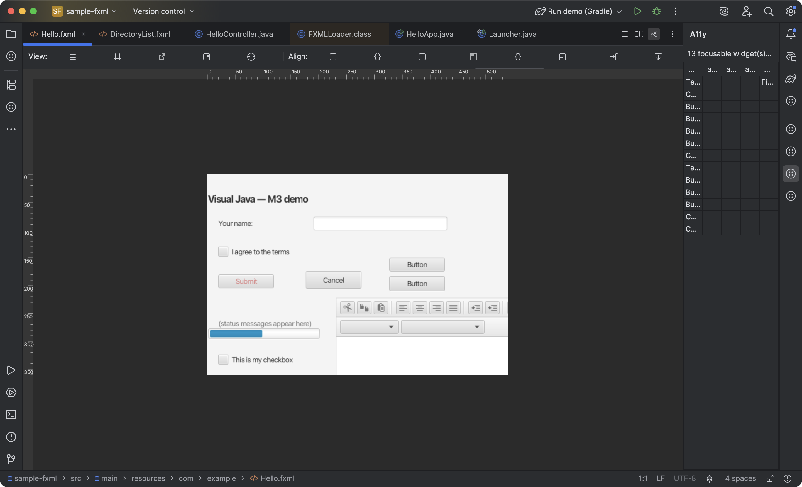

The headline screenshot — Palette on the left, the form rendered live in the
centre, Properties + the support tool windows on the right, designer toolbar
across the top of the editor. Annotations:

- **(1)** Palette tool window — drag widgets onto the canvas. Bottom has a *Register custom control…* button.
- **(2)** Form Outline (below Palette) — the hierarchy tree, with a *Show wrapper nodes (no fx:id)* toggle.
- **(3)** Designer toolbar — View toggles · Align · Run · Tab Order · Menu · Wire-Up · Bind POJO · Wire All.
- **(4)** Canvas — pixel-accurate JavaFX render with selection chrome.
- **(5)** Right strip — Properties · Resources · i18n · A11y · Component Help (each opens from its icon in the right gutter).

---

## Installation

### One-time

```bash
scripts/install.sh
```

That builds `plugin/build/distributions/plugin-<version>.zip`, copies its
path to your clipboard, and prints the steps:

1. **IntelliJ → Settings (Cmd+,)**
2. **Plugins → ⚙ → Install Plugin from Disk…**
3. Pick the .zip, restart the IDE.

### Disable the bundled JavaFX plugin

After install: **Settings → Plugins → search "JavaFX" → uncheck → restart.**

Why: JetBrains' bundled Scene Builder editor registers listeners on FXML
files that run file-index lookups on the EDT during Undo, freezing the IDE.
Visual Java handles `.fxml` files once that plugin is out of the way.

### Dev loop (no real install)

```bash
scripts/dev.sh
```

Launches a sandbox IntelliJ Community 2025.1 with the plugin pre-loaded,
isolated from your real IDE. Plugin changes require re-running this script —
auto-reload is intentionally off because the sandbox JVM can't honour the
restart-required signal.

---

## Creating a form

**Right-click any directory in the Project tree → New → FXML Form.**

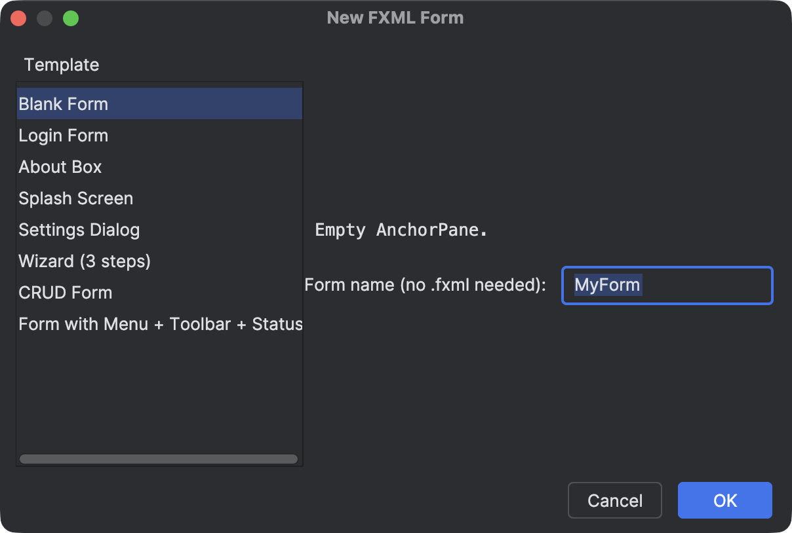

The dialog has 8 templates:

| Template | What you get |
|---|---|
| **Blank Form** | Empty AnchorPane (600×400) |
| **Login Form** | Username + Password + Sign In / Cancel + error label |
| **About Box** | App icon + name + version + description + copyright + OK |
| **Splash Screen** | Logo + tagline + indeterminate progress, gradient background |
| **Settings Dialog** | Sections, checkboxes, theme chooser, UI scale slider, Apply/Cancel |
| **Wizard (3 steps)** | Header + step indicator + Back / Next / Finish |
| **CRUD Form** | ListView on left + detail form on right + Add/Save/Delete |
| **Form with Menu + Toolbar + Status** | Top MenuBar + ToolBar, content area, status label at the bottom |

For data-bound forms, use **File → New → FXML Form from POJO…** instead —
pick a Java class and one widget is generated per bean property, with
`bind(pojo)` / `save(pojo)` already in the controller.

---

## The Designer chrome

### Palette tool window

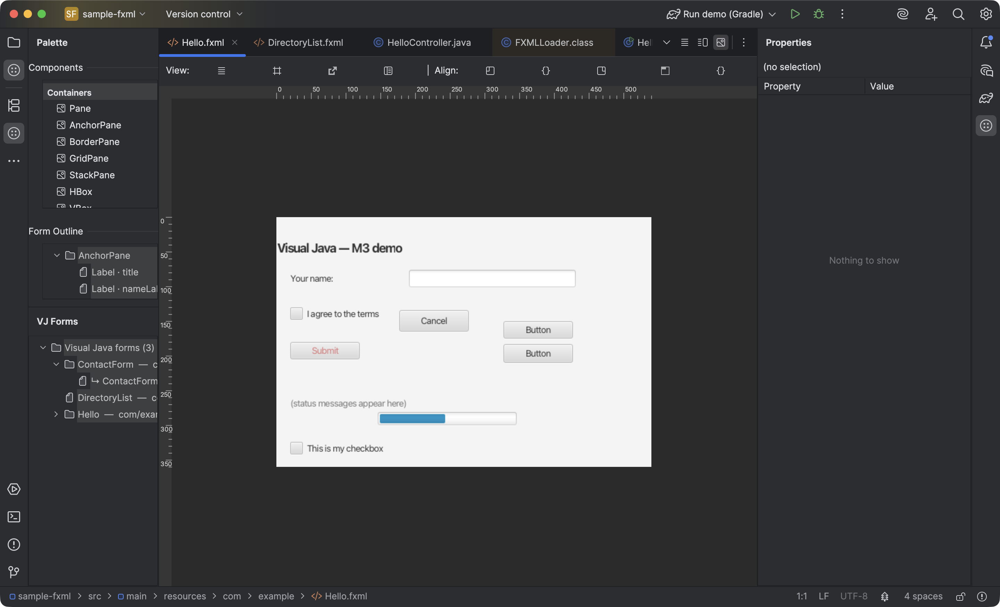

47 widgets in four categories:

| Category | Widgets |
|---|---|
| **Containers (14)** | Pane, AnchorPane, BorderPane, GridPane, StackPane, HBox, VBox, FlowPane, TabPane, ScrollPane, SplitPane, TitledPane, Accordion, ToolBar |
| **Controls (17)** | Button, ToggleButton, MenuButton, Label, Hyperlink, TextField, PasswordField, TextArea, CheckBox, RadioButton, ComboBox, ChoiceBox, DatePicker, ColorPicker, Spinner, Slider, Separator |
| **Lists & Tables (5)** | ListView, TableView, TreeView, TreeTableView, MenuBar |
| **Display (11)** | ProgressBar, ProgressIndicator, ImageView, WebView, MediaView, HTMLEditor, LineChart, BarChart, PieChart, AreaChart, ScatterChart |

**Hovering a palette entry** pops a tooltip with a summary, an FXML snippet,
and (where curated) a controller-code snippet. Drag the entry onto the
canvas to insert.

If you drop on a **Pane-style container** (Pane, AnchorPane, BorderPane,
GridPane, StackPane, HBox, VBox, FlowPane, TilePane), the new widget becomes
a child with `layoutX`/`layoutY` relative to it.

Non-Pane containers have their own slot semantics:

| Container | Drop behaviour |
|---|---|
| **TabPane** | Drop creates a new `<Tab>` with the dropped widget as its content |
| **Accordion** | Wraps the drop in a new `<TitledPane>` and appends to `panes[]` |
| **SplitPane / ToolBar** | Appends to `items[]` |
| **ScrollPane / TitledPane** | Sets the drop as `content` (replaces any existing content) |
| **BorderPane** | Drop position picks the slot — top/bottom/left/right/center based on which third of the pane you landed in |

`layoutX`/`layoutY` are suppressed for non-`children` slots — they wouldn't
make sense there.

**Charts that need axes** (LineChart, BarChart, AreaChart, ScatterChart)
drop pre-seeded with `<xAxis>`/`<yAxis>` of the right type and the matching
`<?import?>` declarations. They render immediately.

**JavaFX runtime modules:** WebView, HTMLEditor, MediaView, and the charts
each need a JavaFX runtime module (`javafx.web`, `javafx.media`, or — for
the charts — just `javafx.controls`). If your project's `build.gradle.kts`
only lists `javafx.controls` and `javafx.fxml`, add the missing ones and
reload Gradle:

```kotlin
javafx {
    version = "21.0.5"
    modules = listOf(
        "javafx.controls", "javafx.fxml",
        "javafx.web",   // WebView, HTMLEditor
        "javafx.media", // MediaView
    )
}
```

### Form Outline tree

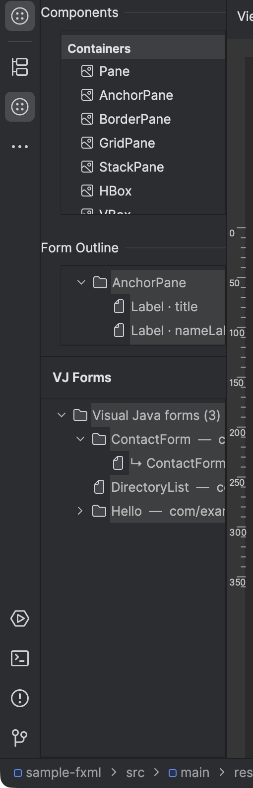

A hierarchy view of the current form. Each entry is `TagName · fx:id`. Click
any node → it gets selected on the canvas (red box + handles) and the
Properties panel updates. Your go-to escape hatch when a container is fully
covered by its children.

The **Show wrapper nodes (no fx:id)** toggle at the top of the panel
controls whether nameless wrapper tags (`<children>`, anonymous panes
without `fx:id`, …) appear in the tree. On by default; turn it off when the
form is fxId-rich and you want a cleaner view.

### Properties tool window


Editable attributes of the selected component, two columns (`Property | Value`).
Type into the value cell, press Enter (or click anywhere else — focus loss
commits). Each edit is one undo step; the canvas re-renders within ~250ms.

Per-widget catalogs are curated — common attributes (text, prefWidth,
prefHeight, style, visible, disable, fx:id) plus widget-specific extras
(`promptText`, `selected`, `showRoot`, `dividerPositions`, `progress`, …).

Two property kinds get richer cell editors:

- **`styleClass` (CSS classes)** — rendered as removable "chip" labels. The
  editor shows the current space-separated value plus an `× class` chip per
  entry that strips itself out on click.
- **`image` on ImageView** — shows the current `@/path/to/image.png` URL
  plus a **Browse…** button that opens a project-scoped file chooser. On
  pick, the path is written as an FXML `@/...` resource reference (relative
  to the project root) so JavaFX's FXML loader resolves it at runtime.

### VJ Forms tool window

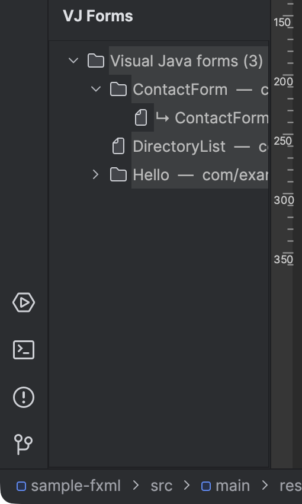

A project-scoped tree of every `.fxml` form, each with its controller class
nested under it. Double-click anything to open. Refreshes automatically when
files are added/removed/renamed.

### Designer toolbar

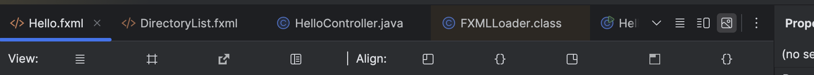

Above the canvas. Six clusters:

| Cluster | Buttons |
|---|---|
| **View** | Rulers · Grid · Snap to grid · Smart guides · Highlight focusable (5 toggles) |
| **Align** | Left · Center · Right · Top · Middle · Bottom · Distribute H/V |
| **Run** | Runs Gradle `:run` in the form's project |
| **Tab Order…** | Opens the focusable-widget order dialog |
| **Menu…** | Opens the Menu Editor |
| **Wire-Up…** | Opens the recipe picker |
| **Bind POJO…** | Opens the POJO binding wizard |
| **Wire All** | Bulk-wires every fxId widget that doesn't have its default event |
| **Size** dropdown | Render at form bounds, 640×480, 800×600, 1024×768, 1280×800, 1366×768, 1920×1080 |

---

## Selection & manipulation

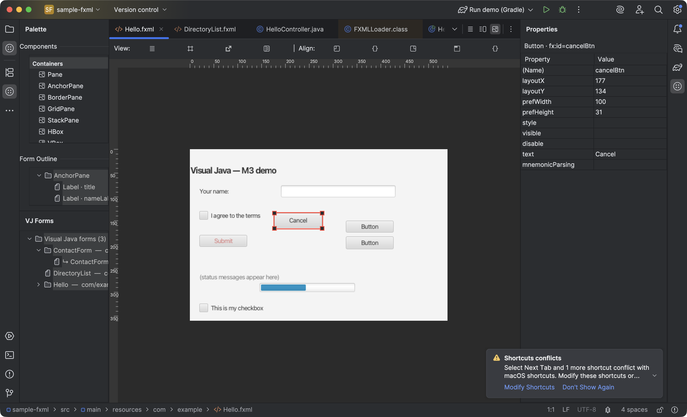

### Selecting

| Gesture | Result |
|---|---|
| Click | Topmost component at the click point |
| Cmd-click / Ctrl-click | Add or remove from multi-selection |
| Alt-click | Climb to the parent of whatever you clicked |
| Form Outline click | Select that node directly |
| Click empty canvas | Deselect everything |

### Moving & resizing

| Gesture | Result |
|---|---|
| Drag a selected component | Move it; layoutX/Y commit on release |
| Drag a corner handle | Resize from that corner; layoutX/Y + prefWidth/Height commit |
| Drag inside a *selected* container | Move the container (sticky-selection drag — children no longer steal the click) |
| Arrow keys | Nudge selection by 1px (works with multi-select) |
| Shift + Arrow | Nudge by the grid size (16px) |

### Deleting / renaming

| Gesture | Result |
|---|---|
| Delete / Backspace | Removes selected components |
| Right-click → **Delete fx:id** | Same |
| Right-click → **Rename fx:id…** | Renames the FXML attribute + the @FXML field + matching handler methods + their `on*="#…"` references |

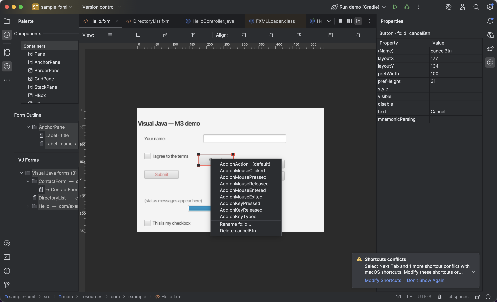

---

## Alignment helpers

Toggle each independently in the **View** cluster of the toolbar. Settings
persist across IDE restarts (per project).

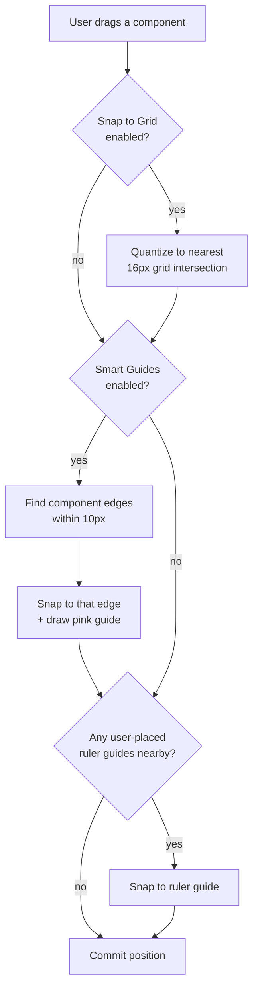
```mermaid
flowchart TD
    Drag[User drags a component]
    SnapG{Snap to Grid<br/>enabled?}
    Quant[Quantize to nearest<br/>16px grid intersection]
    SmartG{Smart Guides<br/>enabled?}
    Find[Find component edges<br/>within 10px]
    Snap[Snap to that edge<br/>+ draw pink guide]
    Ruler{Any user-placed<br/>ruler guides nearby?}
    SnapR[Snap to ruler guide]
    Commit[Commit position]

    Drag --> SnapG
    SnapG -->|yes| Quant
    SnapG -->|no| SmartG
    Quant --> SmartG
    SmartG -->|yes| Find
    Find --> Snap
    Snap --> Ruler
    SmartG -->|no| Ruler
    Ruler -->|yes| SnapR
    Ruler -->|no| Commit
    SnapR --> Commit
```

### Rulers

On by default. Horizontal ruler along the top edge, vertical along the left.
Major ticks every 50px (labelled), minor every 10px. Origin = form's top-left.

### Grid + snap-to-grid

Grid (off by default) paints a faint dot grid every 16px. When **Snap to
Grid** is also on, every drag quantises to the nearest grid intersection.

### Smart guides

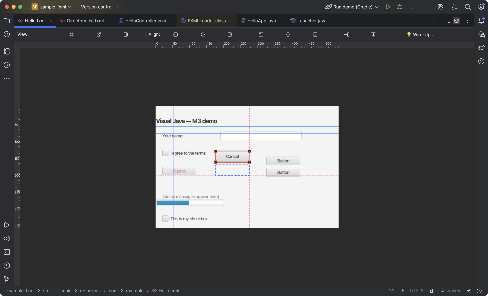

On by default. While dragging, the plugin compares the dragged component's
edges (left, centre-x, right, top, centre-y, bottom) to every other
component's edges. Within 10px, a pink dashed guide appears and the drag
snaps to that alignment.

**Multi-drag also gets smart guides.** Cmd-click multiple widgets, drag —
every secondary node's edges contribute snap candidates too, so the group
locks onto alignments any of its members would make with the rest of the
form.

When **Snap-to-Grid** is also on, the grid quantises first, then smart guides
nudge from there — you get both.

### Ruler-drag guides (Photoshop-style)

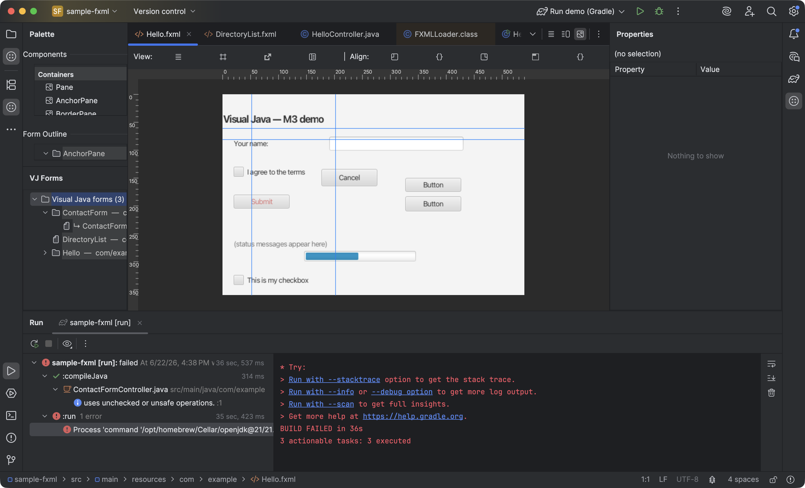

Click-and-drag *from* a ruler onto the canvas:

- Top ruler → **vertical** guide at the dropped X
- Left ruler → **horizontal** guide at the dropped Y

Multiple guides per axis. A dashed blue line follows the cursor during
drag-out. Placed guides render as solid blue lines; components snap to them
during drag (always on, regardless of toggle state).

Remove a guide: right-click on it → **Remove guide**.

Guides persist across editor close in a sidecar file next to the FXML —
`Hello.fxml.design.json`. Check this in to share guides with your team, or
ignore it in `.gitignore` if you'd rather not.

### Highlight focusable

Toggle on in the **View** cluster (the rightmost toggle, locator icon). Draws
a small numbered orange badge on the top-left of every tab-focusable widget
in scene-graph order — same order the Tab Order dialog edits. Useful for a
quick a11y check: *"Will the user tab through these in the order I expect?"*
without opening the dialog.

Numbers update live as you reorder via the Tab Order dialog or as new
widgets are dropped.

*(Screenshot pending — toggle the View cluster's locator icon to see the
overlay on your own form.)*

### Align toolbar

Cmd-click to select 2+ components, then click any Align button. With a
**single** component selected, Align actions align to the **form's
prefWidth/prefHeight** (Align Right pushes it to the form's right edge,
Align Center horizontally centres it on the form, etc.).

---

## Wiring events

### Double-click → default event

Double-click any widget to wire its canonical event:

| Widget | Default event |
|---|---|
| Button, ToggleButton, CheckBox, RadioButton, ComboBox, ChoiceBox, TextField, PasswordField, MenuItem | `onAction` |
| Everything else | `onMouseClicked` |

This generates (or navigates to) a method in the controller and wires
`on<Event>="#methodName"` on the FXML.

### Right-click → full events list

Right-click → menu of every event for the widget. Pick one → same flow.
The menu also has **Rename fx:id…** and **Delete** entries.

### Generated bodies — usable cheat-sheets

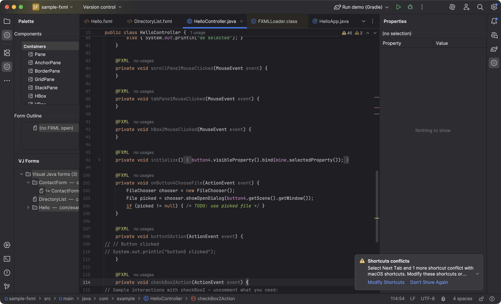

Freshly-generated methods are **pre-filled with a per-widget cheat-sheet**
that uses the actual `fx:id`. Example for `CheckBox.onAction`:

```java
@FXML
private void agreeCheckAction(ActionEvent event) {
    // Sample interactions with agreeCheck — uncomment what you need:
    //
    // boolean checked = agreeCheck.isSelected();
    // if (checked) {
    //     // agreeCheck was just checked
    // } else {
    //     // agreeCheck was just unchecked
    // }
    //
    // // Modify state:
    // agreeCheck.setSelected(!checked);
    // agreeCheck.setText("New label");
    // agreeCheck.setIndeterminate(false);
    // agreeCheck.setDisable(true);
}
```

Equivalent cheat-sheets exist for ToggleButton, Hyperlink, TextField,
PasswordField, TextArea, ComboBox/ChoiceBox, DatePicker, ColorPicker,
Spinner, Slider, ListView, TableView, TreeView, TabPane, ProgressBar,
ProgressIndicator, ImageView, plus a generic event-data block at the bottom
(`event.getX()`, `event.getButton()`, `event.getCode()`, modifier flags…).

**Existing method bodies are never overwritten.** Re-wiring the same event
just navigates to the existing method.

### Controller bootstrap

If the FXML has no `fx:controller` yet, the first wire-up:

1. Mirrors the FXML's resources sub-path under the module's Java source root
   (e.g., `src/main/resources/com/example/Hello.fxml` →
   `src/main/java/com/example/HelloController.java`).
2. Creates the controller class with the right package declaration.
3. Writes `fx:controller="com.example.HelloController"` into the FXML root.

The plugin **never writes a `.java` file into a resources directory**. If
no Java source root exists, you get a yellow balloon explaining what's
missing instead.

---

## Wire-Up recipes

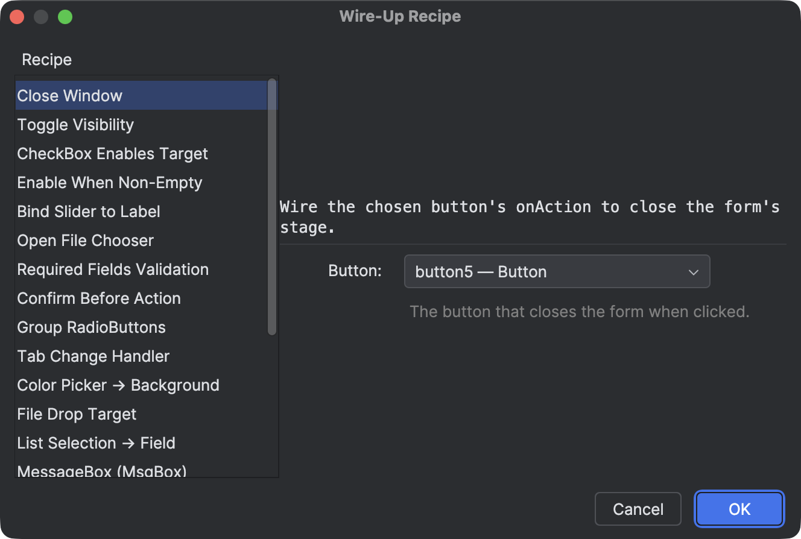

The toolbar's **Wire-Up…** button opens a dialog listing 21 recipes — pre-baked
code generators that connect components to common JavaFX patterns. Pick one,
assign roles, click OK. Statements written to `initialize()` are
**idempotent** — re-running a recipe won't duplicate the binding.

### Recipe catalog

| Recipe | Roles | What it writes |
|---|---|---|
| Close Window | Button | onAction calls `((Stage) btn.getScene().getWindow()).close()` |
| Toggle Visibility | Trigger + Target | `target.visibleProperty().bind(trigger.selectedProperty())` |
| CheckBox Enables Target | Trigger + Target | `target.disableProperty().bind(trigger.selectedProperty().not())` |
| Enable When Non-Empty | TextField + Button | `target.disableProperty().bind(source.textProperty().isEmpty())` |
| Bind Slider to Label | Slider + Label | `label.textProperty().bind(slider.valueProperty().asString("%.1f"))` |
| Open File Chooser | Button + (optional) TextField | onAction with `FileChooser`; writes path to TextField |
| Required Fields Validation | Button + 1–4 fields | onAction checks all non-empty, shows warning Alert, else calls `handleSubmit()` (stub) |
| Confirm Before Action | Button | onAction shows Yes/No Alert; on YES calls `handleConfirmed()` (stub) |
| Group RadioButtons | 2–4 RadioButtons | `ToggleGroup` in initialize() + `setToggleGroup` per RadioButton |
| Tab Change Handler | TabPane | `selectedItemProperty().addListener` calling `onXChanged(Tab)` (stub) |
| Color Picker → Background | ColorPicker + Target | Listener that sets target's inline `-fx-background-color`; generates `colorToHex` helper |
| File Drop Target | Drop Target | onDragOver + onDragDropped wiring + `onFileDropped(File)` (stub) |
| List Selection → Field | ListView/TableView/TreeView + Label/TextField | Listener that puts selected item's `toString()` in target |
| **MessageBox (MsgBox)** | Button | onAction shows an INFORMATION Alert |
| **InputBox** | Button + (optional) TextField | onAction shows TextInputDialog; writes value to target or to `handleInputValue(String)` (stub) |
| **Background Task** | Button + (optional) ProgressBar + (optional) Label | Runs work in a `Task<Void>`; ProgressBar/Label bound; `doWork(Task)` (stub) |
| **Timer (Periodic Action)** | Anchor | `Timeline` running `onTimerTick()` every 1000ms |
| **Open Another Form** | Button | Loads another FXML in a new Stage |
| **Status Bar** | Status Label | Generates `setStatus(String)` + `setStatusFor(String, Duration)` helpers |
| **Show Modal Dialog** | Button | Opens FXML as `APPLICATION_MODAL` with owner = current window |
| **Auto-Populate Choices** | ComboBox/ChoiceBox/ListView | Fills items with starter values in initialize() |

---

## Visual editors

### Menu Editor

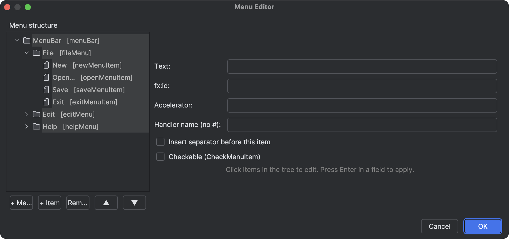

Toolbar **Menu…** button. Tree of MenuBar → Menu → MenuItem on the left with
+Menu / +Item / Remove / ▲ / ▼ buttons. Right side has fields for text,
fx:id, accelerator, handler name, plus checkboxes for "Insert separator
before this item" and "Checkable (CheckMenuItem)".

OK writes a `<MenuBar>` block at the top of `<children>` plus the needed
`<?import?>`s. The MenuBar gets `fx:id="menuBar"`; each menu and item gets
its own fx:id. Items with a handler name get `onAction="#handlerName"` so
you can then double-click to write the handler body.

**Round-trip:** Re-opening the editor on a form that already has a
`<MenuBar>` parses it back into the tree, so you edit incrementally rather
than rebuilding from scratch. The old MenuBar is deleted on OK and the
edited one written in its place, so you never end up with two.

### Tab Order

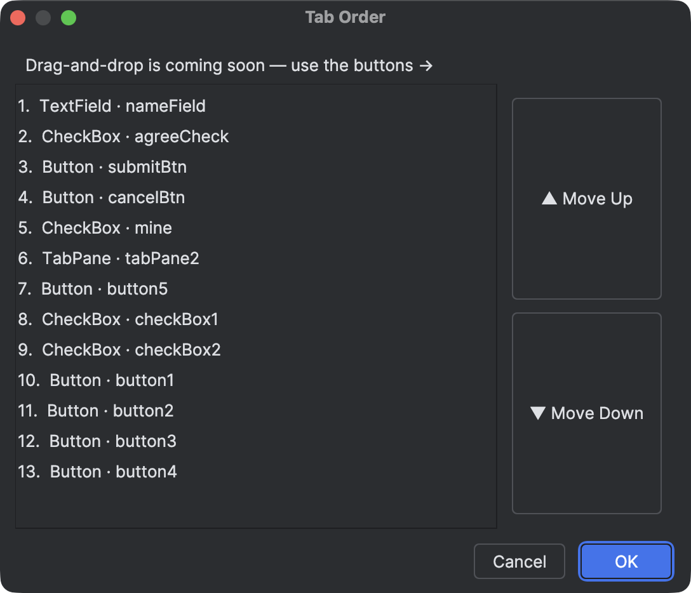

Toolbar **Tab Order…** button. Lists every focusable widget on the form in
current tab order (depth-first sibling order in FXML). Each row shows
`tagName · fxId  —  in <parent>` so cross-parent context is visible.

Two ways to reorder:

- **Drag a row** to a new position. Drop on a row in a *different* parent
  to reparent — the OK action then moves the FXML tag into the new parent's
  `<children>` collection.
- **▲ / ▼ buttons** swap with the neighbour above/below. Buttons also
  reparent when the neighbour is in a different container.

Cross-parent moves work for any focusable widget. Whole-subtree moves (a
container plus all its children) aren't supported by this dialog — for that,
edit the FXML source.

### TableView Column Editor

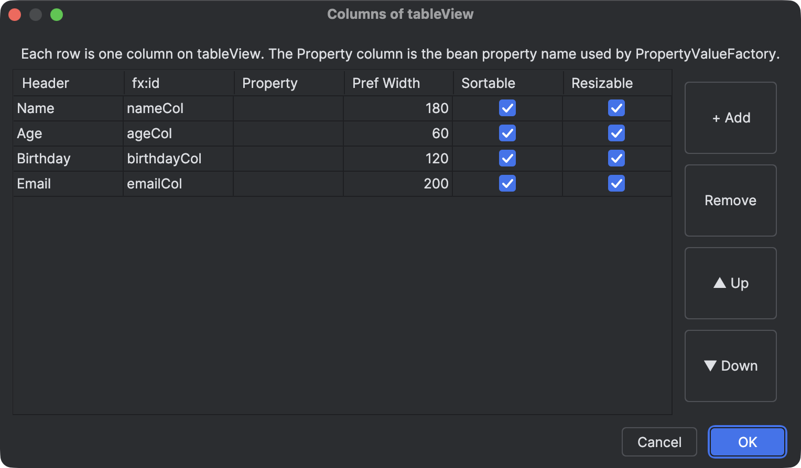

Right-click any TableView on the canvas → **Edit columns…**. Editable rows
of (Header, fx:id, Property, Pref Width, Sortable, Resizable) with
Add/Remove/▲/▼. Loads existing `<columns>` to populate; writes the new
block back via PSI with `<PropertyValueFactory property="…"/>` per column.

At runtime, populate `myTable.setItems(...)` with `Contact` (or any POJO)
instances — `PropertyValueFactory` uses the property name to call the
matching getter.

### POJO Binding Wizard

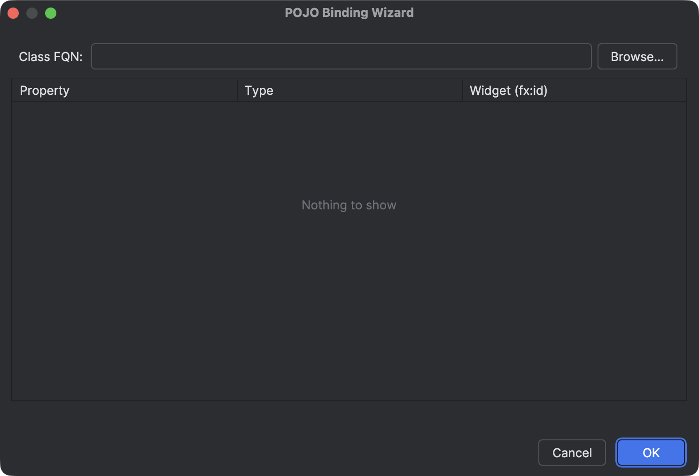

Toolbar **Bind POJO…** button. Type a class FQN (or Browse for a class
chooser), the dialog lists every bean property — getter (`getX`/`isX`) +
optional setter (`setX`) — and proposes a widget by fx:id based on name
similarity and type match. OK emits:

- `public void bind(MyClass pojo)` — copies pojo → widgets
- `public void save(MyClass pojo)` — copies widgets → pojo (skipped for
  read-only properties)
- `@FXML` fields for every mapped widget

Type-aware: handles String / boolean / int / long / double / float /
LocalDate / Color / enum / other with appropriate widget accessors.
Unrecognised combos emit a `// TODO` line you can fix.

#### Form from POJO

**File → New → FXML Form from POJO…** generates an entire form from a
class: one labelled row per property using TextField / CheckBox / Spinner /
Slider / DatePicker / ColorPicker / ComboBox, plus a Save button. Then it
auto-runs the binding wizard so the controller already has bind/save.

---

## Component Help & sample code

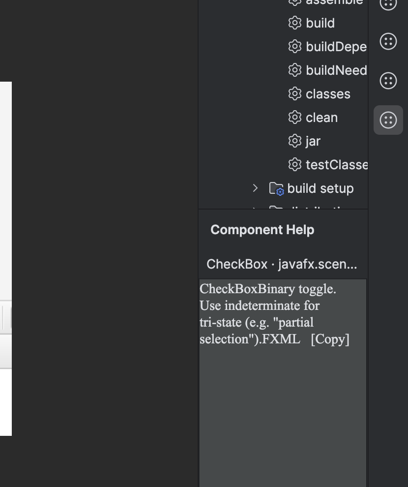

A **Component Help** tool window in the right gutter shows reference docs
for whatever widget is currently selected:

- **Summary** — one or two sentences on what the widget is for.
- **FXML** — copy-pastable snippet with `fx:id` and the attributes you
  usually want; `[Copy]` link.
- **Controller (Java)** — `@FXML` field + a typical usage idiom (event
  handler, live-validation listener, value-factory setup, `bind(...)` chain,
  etc.); `[Copy]` and `[Paste into controller (/* */)]` links.
- **Common properties** — quick table with one-line "what is this for".
- **Common events** — same for events.
- **Links** — Oracle Javadoc for the class, plus a tutorial link where
  applicable.

About ~30 widgets are hand-curated with depth. Everything else gets an
auto-generated stub with the Oracle Javadoc link, so nothing is empty.

### Hover the palette for a quick read

Hovering any palette entry pops a tooltip with the summary + FXML snippet +
the controller snippet (when curated). For full property/event tables and
copy/paste links, open the Component Help tool window.

### Drop the example into your controller

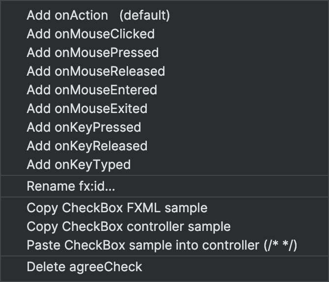

Right-click any widget on the canvas. Below the events list and Rename/Delete
items you'll find:

- **Copy `<Widget>` FXML sample** — clipboard.
- **Copy `<Widget>` controller sample** — clipboard.
- **Paste `<Widget>` sample into controller (`/* */`)** — finds (or creates)
  the FXML's controller class via `fx:controller`, drops the sample at the
  top of the class body wrapped in a `/* … */` block, and opens the
  controller in the editor at the insertion point. Uncomment the parts you
  want to keep; delete the rest.

Same actions are available as `[Copy]` and `[Paste into controller]` links
in the Component Help window's headings.

---

## Resources tool window

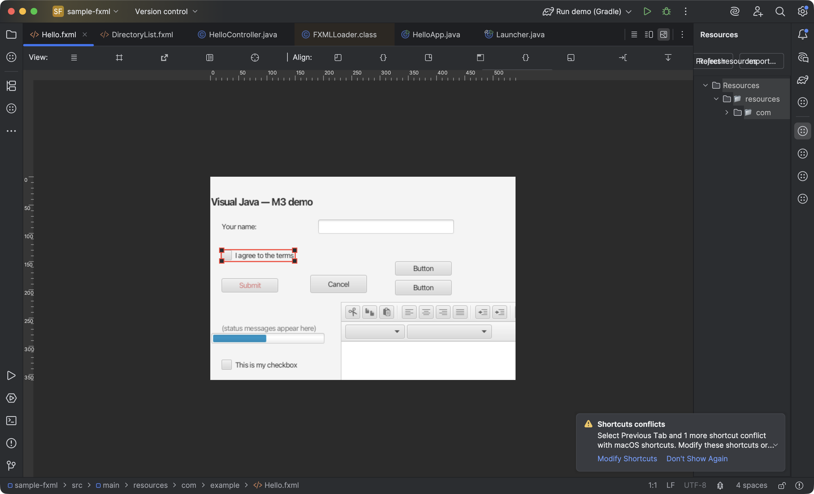

A central view of everything under your project's resource source roots
(`src/main/resources/...`). Icons distinguish:

- 🖼️ Images (png/jpg/jpeg/gif/bmp/svg)
- 🎨 CSS stylesheets — these are also automatically picked up by the
  designer's **live CSS preview** (see below).
- 📄 FXML files
- 🌐 `.properties` bundles (also visible in the i18n editor)
- 📁 Directories

**Double-click** an entry to open it in IntelliJ's regular editor for that
file type.

**Import…** opens a file chooser; the selected file is copied into the
folder selected in the tree (or the first resource root if no folder is
selected).

**Live CSS preview:** the sidecar renderer applies every CSS file from the
resource roots to the rendered scene each render, in the order
`ProjectStylesheets.discover()` walks them. Edit a `.css` file, save, and
the next render of any open FXML reflects the new styles — no IDE restart
required.

---

## i18n editor

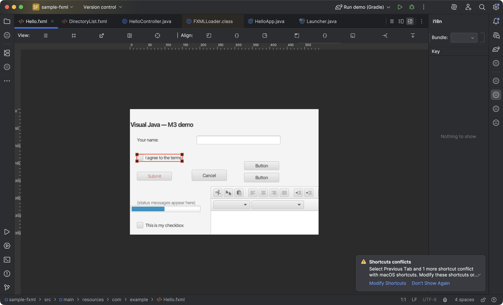

A `ResourceBundle` authoring view. Pick a base bundle name (e.g.
`strings`), and the editor lists every key across every detected locale as
a single editable grid:

| Key            | (default) | de         | fr         |
|----------------|-----------|------------|------------|
| `app.title`    | My App    | Meine App  |            |
| `button.save`  | Save      |            | Sauver     |

Locale columns are auto-detected from sibling files
(`strings.properties`, `strings_de.properties`, `strings_fr_CA.properties`,
…). Empty cells = missing translation.

| Button | Action |
|---|---|
| **+ Key** | Add a new row (prompts for the key name) |
| **+ Locale** | Add a new column (prompts for the locale code, e.g. `de`, `fr_CA`) |
| **Save** | Write every locale's `.properties` file back to disk |
| **Refresh** | Re-detect bundles + reload from disk |
| Double-click a cell header | Opens the underlying `.properties` file in IntelliJ |

Out of scope for v1: machine translation, plural rules, "unused key" lint.

---

## Accessibility inspector

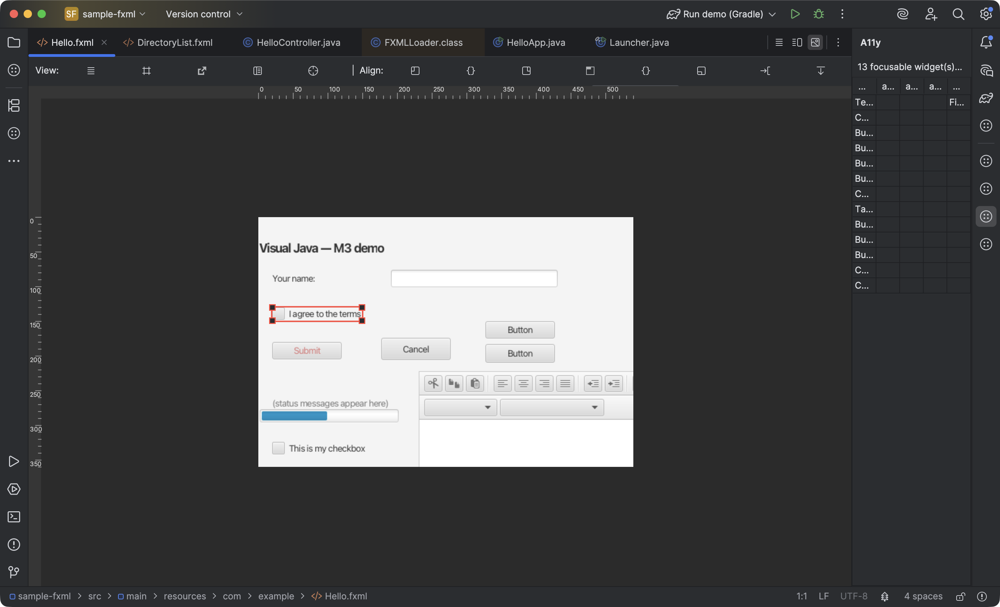

Lists every focusable / labelled widget on the active form and surfaces
the `accessibleText`, `accessibleRole`, and `accessibleHelp` attributes
inline. Edit any cell → it commits to the FXML via PSI (same
`WriteCommandAction` path as the Properties panel).

A **Warnings** column lints common a11y gaps:

- Icon-only Button with no `accessibleText` — screen readers will read
  nothing.
- TextField / PasswordField with no visible label *and* no
  `accessibleText` — assistive tech can't name the field.
- ImageView with no `accessibleText` — set one, or mark it decorative.

The on-canvas **Highlight focusable** toggle (see [Alignment helpers](#highlight-focusable))
is the visual companion — same focus order, painted on the form.

---

## Custom controls

The palette ships with 47 built-in widgets. To add your own:

1. Click **Register custom control…** at the bottom of the Palette tool
   window.
2. Enter the fully-qualified class name (e.g. `com.example.MyFancyButton`).
3. Optionally override the display name and default attributes
   (`prefWidth=120 prefHeight=24`).

The new entry appears under a *Controls* header below the built-ins; drag
it onto the canvas like any other widget. The drop generates the right
`<?import?>` and `<TagName fx:id="..." ...>` block.

Custom-control registrations are stored at
`.idea/visualjava-custom-controls.json` so they follow the project and are
shareable via VCS.

**Requirements:** the class must be a JavaFX `Node` subclass with a public
no-arg constructor (FXML calls `Class.forName(...).getConstructor().newInstance()`).
Without it, the sidecar renderer's `FXMLLoader.load()` will fail.

---

## Packaging (jpackage)

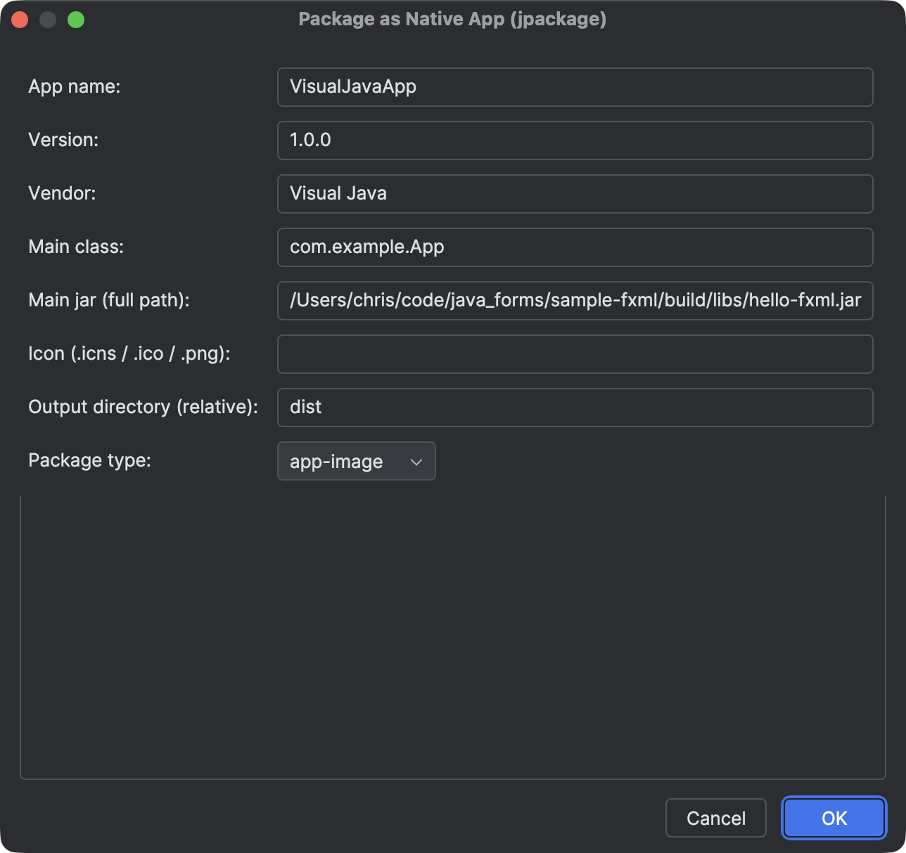

`Cmd+Shift+A → "Visual Java — Package App (jpackage)…"` opens a wizard
that drives the JDK's `jpackage` tool to produce a native app bundle
(`.app` / `.dmg` / `.exe` / `.msi` / `.deb` / `.rpm`, depending on host
OS).

Fields:

| Field | What it maps to in `jpackage` |
|---|---|
| App name | `--name` |
| Version | `--app-version` |
| Vendor | `--vendor` |
| Main class | `--main-class` |
| Main jar | `--input` (parent dir) + `--main-jar` (filename) |
| Icon | `--icon` (optional; `.icns`, `.ico`, or `.png`) |
| Output directory | `--dest` (relative to project root) |
| Package type | `--type` — the dropdown lists what's possible on the host OS |

**Requires:** the module must already produce a runnable jar (Gradle's
`application` plugin + `shadowJar` is the easy path). Output log streams
into the dialog as `jpackage` runs.

---

## Export to web (v2 preview)

The plan's headline v2 vision is dual-output — the same FXML drives both
a JavaFX desktop app and a Spring + Thymeleaf web app. A v1 *scaffold* is
in place:

`Cmd+Shift+A → "Visual Java — Export to Web (Thymeleaf, v2 preview)…"`
writes:

- `web/<FormName>.html` — Thymeleaf-flavoured template translating each
  FXML widget into HTML (`<div>` for layout containers, `<button>` for
  Buttons, `<input>` for TextField / CheckBox / RadioButton, `<table>` for
  TableView, `<nav>` for MenuBar, …).
- `web/<FormName>Controller.java` — a commented Spring `@Controller` stub
  with `@GetMapping`/`@PostMapping` skeletons.

About a dozen widget types are translated; unknowns emit a
`<!-- TODO: translate <X> -->` comment so the gap is visible. Live preview
in an embedded browser pane, automatic Spring model binding, and FXML ⇄ HTML
round-trip are the remaining v2 work — the scaffold gets the foundation in
place.

---

## Power-user features

### Bulk wire unwired events

Toolbar **Wire All** button. Scans the form for fxId-bearing widgets whose
canonical event isn't wired. Shows a confirmation dialog listing up to 8
candidates ("`submitBtn (onAction)`", "`agreeCheck (onAction)`", …). On
confirm, generates stubs for all in **one undo step**, each with the same
per-widget cheat-sheet body as the single-wire path.

### Rename fx:id

Right-click any widget → **Rename fx:id…**. Updates atomically:

1. The FXML `fx:id` attribute.
2. The `@FXML` field in the controller.
3. Every method whose name starts with `<oldFxId>` followed by a capital
   letter (matches our generated `<fxId>Action`, `<fxId>MouseClicked`, etc.).
4. Every FXML `on*="#<oldName>"` reference pointing at those renamed
   methods.

Refuses with a clear error if the new name already exists in the form or
isn't a valid Java identifier.

---

## Running the app

The plugin produces an FXML + Controller pair. To actually run the JavaFX
app you need a Gradle project around it (the `sample-fxml/` directory in
this repo is a working example).

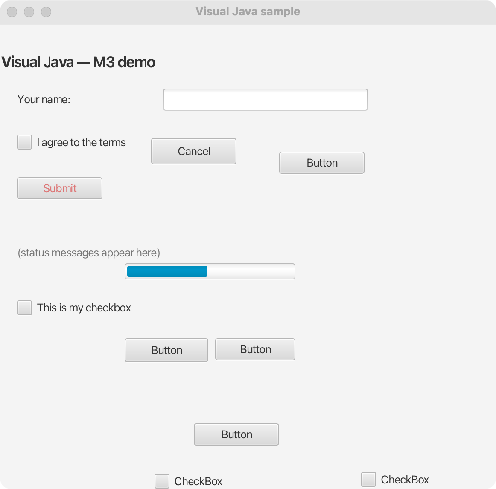

### Via the Run toolbar button

The designer toolbar's **Run** button invokes Gradle's `:run` task in the
module that owns the active FXML file. The Run window shows output; a
JavaFX window appears when the app boots.

### Via Gradle in a terminal

```bash
./gradlew run
```

The openjfx Gradle plugin injects the right `--module-path` /
`--add-modules` JVM args. Window appears.

### Via IntelliJ Run/Debug from the .java file

A bare `HelloApp.main()` run config doesn't get the JavaFX JVM args, so it
fails with *"JavaFX runtime components are missing"*. The fix is a
non-`Application` entrypoint:

```java
public final class Launcher {
    public static void main(String[] args) {
        HelloApp.main(args);
    }
}
```

Run / Debug **Launcher.main()** instead. JavaFX is found on the classpath
(where Gradle puts it) and the JDK launcher's "is it an Application
subclass" check doesn't trip.

The sample project also ships two `.idea/runConfigurations/*.xml` files —
"Debug demo (Launcher)" and "Run demo (Gradle)" — both work for breakpoints.

---

## Source-tab round-trip

The dual-tab editor's Source side is a normal IntelliJ XML editor. Hand-edit
the FXML there and:

- The Form Outline tree refreshes within ~200ms.
- The Designer canvas re-renders within ~150ms.
- Existing selection rebinds to its new bounds.

Conversely, every designer action (drop, drag, delete, properties edit,
align, recipe, menu editor, rename, …) writes through to the FXML PSI in
one `WriteCommandAction`. Ctrl-Z undoes the action exactly.

---

## Known limitations

| Issue | Workaround |
|---|---|
| Bundled JavaFX plugin freezes the IDE on FXML undo | Disable it (Settings → Plugins → JavaFX → uncheck) |
| Wire-Up recipes assume the controller is in a Java source root mirrored from a resource root | Use the standard `src/main/resources/<pkg>/` + `src/main/java/<pkg>/` layout |
| Renderer process needs ~200ms per render; rapid-fire drops can race | Wait briefly between drops |
| Dropping WebView/HTMLEditor/MediaView doesn't add `javafx.web`/`javafx.media` to your `build.gradle.kts` | Add the missing modules and reload Gradle (see [Palette](#palette-tool-window)) |
| Tab Order's drag-drop reorders one widget at a time | Subtree moves (a container plus all its children) need a hand-edit |
| Web export is a v1 scaffold — no live browser preview, no Spring model binding | Hand-finish the generated `<FormName>.html` + `<FormName>Controller.java` |
| Custom controls need a public no-arg constructor | Wrap classes that don't into a small Pane subclass that has one |
| Live CSS preview only applies stylesheets it finds under resource roots | Move project CSS into `src/main/resources/...` |

---

## Troubleshooting

### "Render failed: No controller specified"

You wired an event handler so FXML has `onAction="#…"`, but the controller
class doesn't have that method. Re-run the wire-up to generate it, or
remove the attribute by hand in Source.

### Designer tab doesn't appear

The bundled JavaFX plugin's `org.jetbrains.plugins.javaFX` may have
re-registered for `.fxml`. Disable it in Settings → Plugins.

### IDE hangs on Undo

A SlowOperations exception on EDT with a stack including
`SceneBuilderEditor.addSceneBuilderImpl` means the bundled JavaFX plugin
is misbehaving. Disable it.

### Plugin install rejected as "incompatible"

The plugin manifest declares `sinceBuild=251`, `untilBuild=252.*`. Check
Help → About; if it's 2025.3 or later, edit `plugin/gradle.properties` to
widen `pluginUntilBuild`, then rebuild.

### Sandbox shuts down after ~50 seconds

That's IntelliJ requesting a restart it can't honour. Auto-reload is
supposed to be off — check that `plugin/build.gradle.kts` still has the
`-Didea.auto.reload.plugins=false` JVM arg on the `runIde` task.

### "Run This Form" does nothing

Check that the active FXML's directory has a `build.gradle.kts` (or
`build.gradle`) above it. If not, the action shows a yellow balloon
explaining the gap.

### Compile error: `cannot find symbol: HTMLEditor / WebView / MediaView`

The widget exists in the FXML and renders fine in the designer, but the
project doesn't have the JavaFX module that hosts the runtime class. Add
`javafx.web` (for WebView / HTMLEditor) and/or `javafx.media` (for
MediaView) to the `javafx { modules = listOf(...) }` block in
`build.gradle.kts`, then **reload Gradle** in the project tool window.

### Custom-control drop fails with "ClassNotFoundException" in the renderer

The sidecar renderer can't load classes it doesn't know about. Two options:

1. Drop the custom control at runtime, not in the designer — register it
   in the FXML source by hand and let it render at app launch only.
2. Add the custom control's compiled jar to the sidecar renderer's
   classpath (an open enhancement).

### Help window shows "no curated docs yet" for some widgets

The Component Help catalog hand-curates ~30 widgets. Anything else falls
back to a stub with the Oracle Javadoc link. To add a curated entry, edit
`plugin/src/main/kotlin/com/visualjava/help/ComponentDocsCatalog.kt`.
